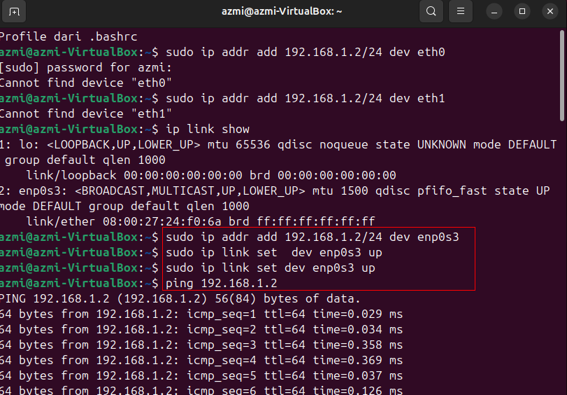

Prakti menyambungkan antar dua perangkat yang berbeda.
---

By,Muhammad Azmi

09011282328075

SK3C

Praktikum Sistem Operasi

Untuk praktik kali ini saya akan menghubungkan dua mesin virtual di dua device berbeda(Laptop dan PC) yang menggunakan OS Linux Ubuntu dan Mint. Saya menggunakan metode penyambungan ssh secara kabel(LAN) dan nirkabel(WLAN).
Berikut adalah langkah yang saya lakukan:

1. Menggunakan Kabel LAN

 

  
   

  
   

  
   

Pertama-tama saya menyeting jaringan di virtualbox menggunakan Bridge adapter,setelah itu pilih port LAN pada Virtualbox kedua device.

Berikut spek singkat dari Laptop dan PC yang saya gunakan untuk validasi kalau saya menggunakan 2 perangkat berbeda:

Untuk Laptop:

  
   

OS: Windows 11 Enterprise LTSC 24h2

CPU: i5 3210m 2.5Ghz

Memory: DDR3 8GB 1600mhz Dualchanel

Seri Mobo: k55vm Rev 2.2

Chipset: HM71

LAN: Realtek PCIe GbE Family controller

WiFi Card: Atheros Wifi Card

---
Untuk PC:

  
   

OS: Windows 11 Enterprise LTSC 24h2

CPU: i7 4770k 3.5Ghz

Memory: DDR3 12GB 1333mhz Dualchanel (4.2.4.2)

Seri Mobo: ASRock fatal1ty killer Z87

Chipset: Z87

LAN: Killer E2200 Gigabit Ethernet

WiFi: USB WiFi dogle

---
Setelah LAN sudah terpilih, maka selanjutnya tinggal masuk ke Linux di kedua laptop.

  
   

Pada kedua laptop saya menyeting Ip address secara manual,hal ini diperlukan supaya LAN terhubung.

Ip Address Laptop: 192.168.1.3

Ip Address PC: 192.168.1.2

