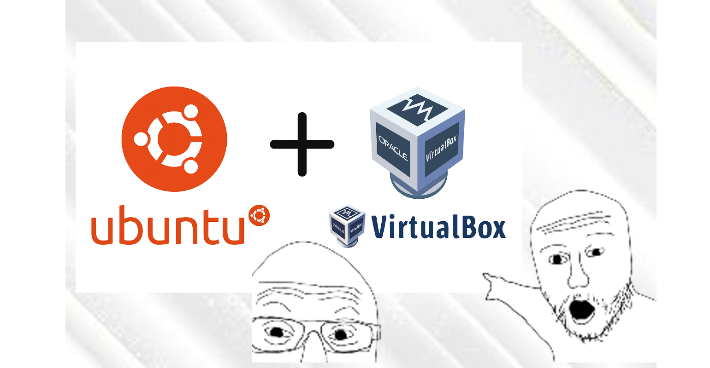

Langkah-langkah Menginstal Ubuntu di Virtualbox

Anda bisa mendownload file PDF untuk diperiksa,download melalui Release dimungkinkan.

## TUGAS YANG LAINNYA
-[TUGAS KE 3, Tugas 50 command](Tugas_3)

Tugas 1 & tugas 2
---------------------------------------------------------------------------------------
Nama: Muhammad Azmi

NIM: 09011282328075

Kelas: SK3C

MK: Praktikum Sistem Operasi

Tugas 1
-------
Bahan yang diperlukan iyalah berikut:

*Virtual box versi 6.1 (OLD) [Download di sini.](https://download.virtualbox.org/virtualbox/6.1.50/VirtualBox-6.1.50-161033-Win.exe)

*File .ISO dari Linux,disini saya pakai Ubuntu 24.04.1 [Download Ubuntu di sini](https://linux.domainesia.com/ubuntu/iso-release/24.04.1/ubuntu-24.04.1-desktop-amd64.iso)

Setelah mendownload semua file dan program yang diperlukan,bisa lanjut ke tutorial dibawah.

Langkah - langkah
-----------------

1. Pada virtualbox pilih Add untuk menambahkan operating system baru.
   

  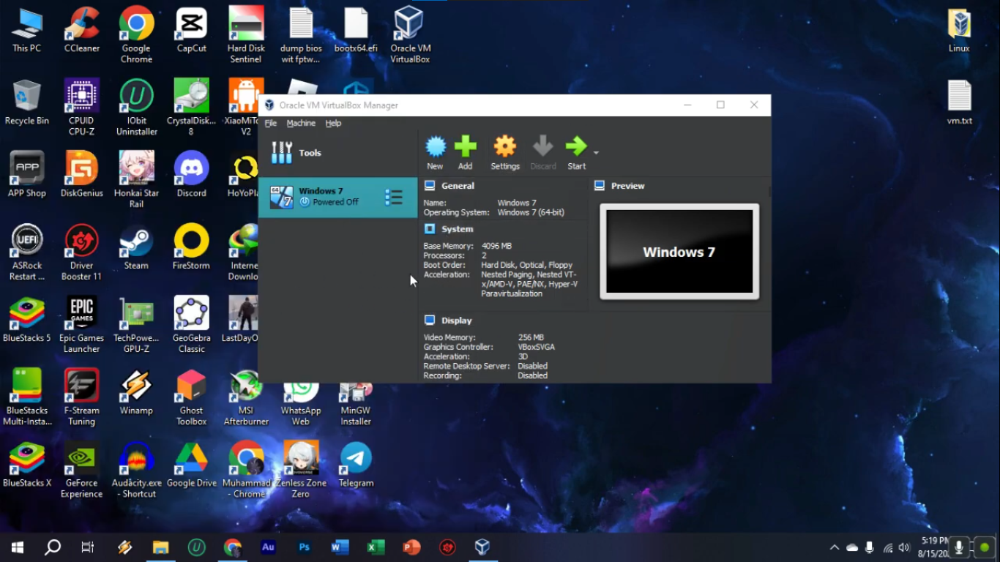
   

   
#

2. Beri nama virtual machine dan pilih file .iso dari operating system yang ingin di pasang.
                     Disini saya menggunakan Linux Ubuntu 24.04 LTS.
   

  
   

#

3. Sesuaikan Memory dan prosessor yang akan dialokasikan untuk virtual machine yang akan digunakan.

  
   

#
    
4. Alokasikan Storage yang akan bisa digunakan untuk OS pada virtual machine.
   

  
   

#

5.  Beginilah kira-kira.

    Setelah itu run kan OS yang sudah di setup sebelumnya

  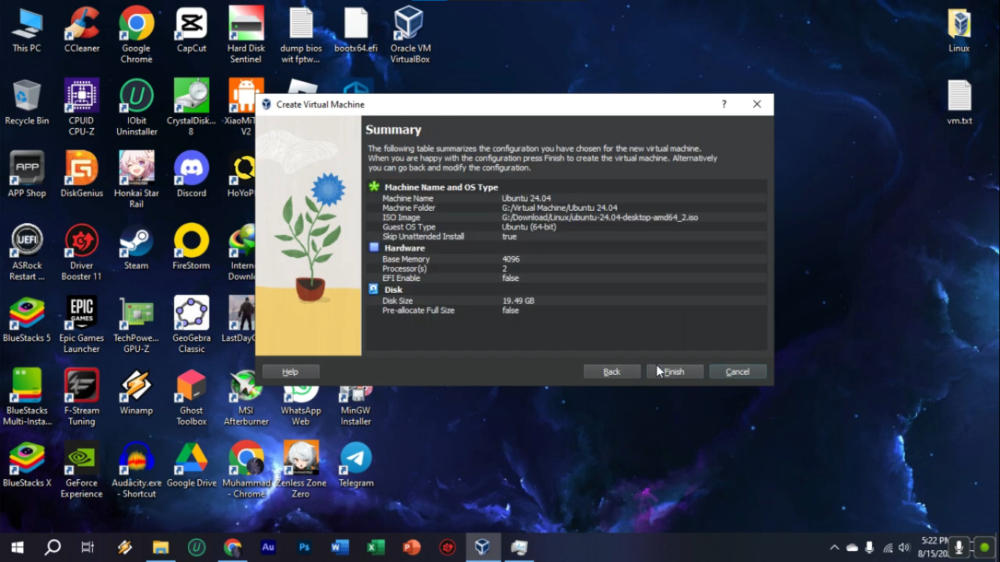
   

#

6. Untuk Ubuntu Pilih “Try or Install Ubuntu”, jika menghadapi isu kompatibilitas graphic hardware pilih pilihan kedua.

  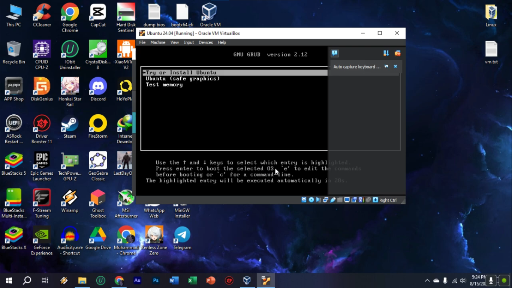
   

#

7. Beginilah tampilan awal setelah boot,anda bisa langsung setup untuk menginstall Ubuntu.

  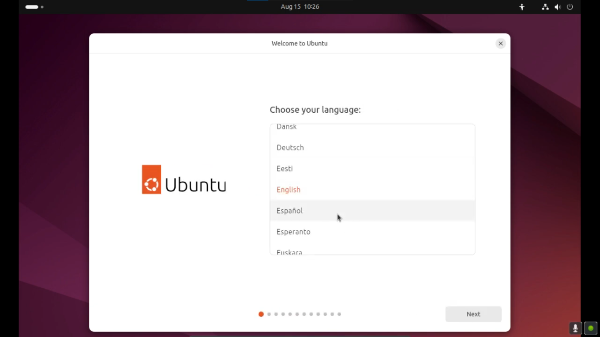
   

#

8. Disini pilih install Ubuntu karena kita ingin menginstalnya pada VM kita.

  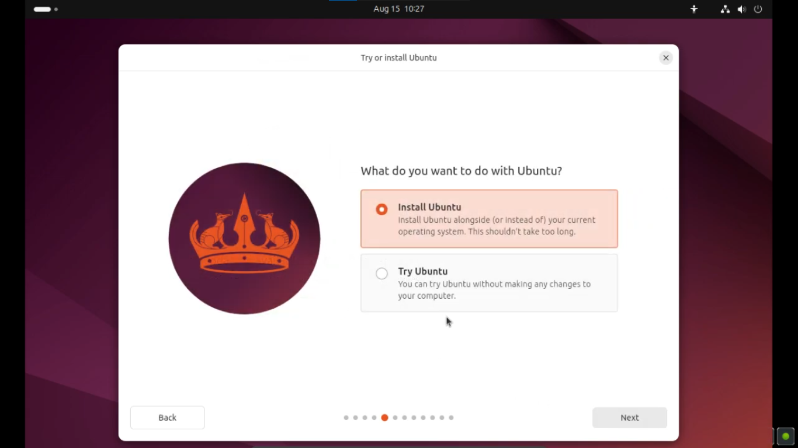
   

#

9. Pilih interactive Installation untuk kemudahan.

  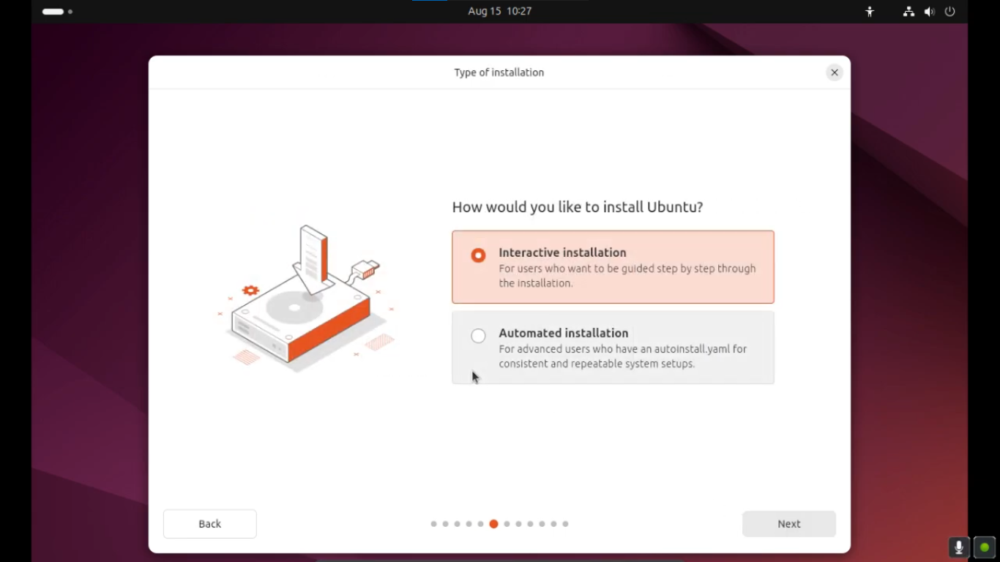
   

#

10. Centang semua opsi untuk langsung memasang driver seperti driver sound,format video,WI-FI dll.

  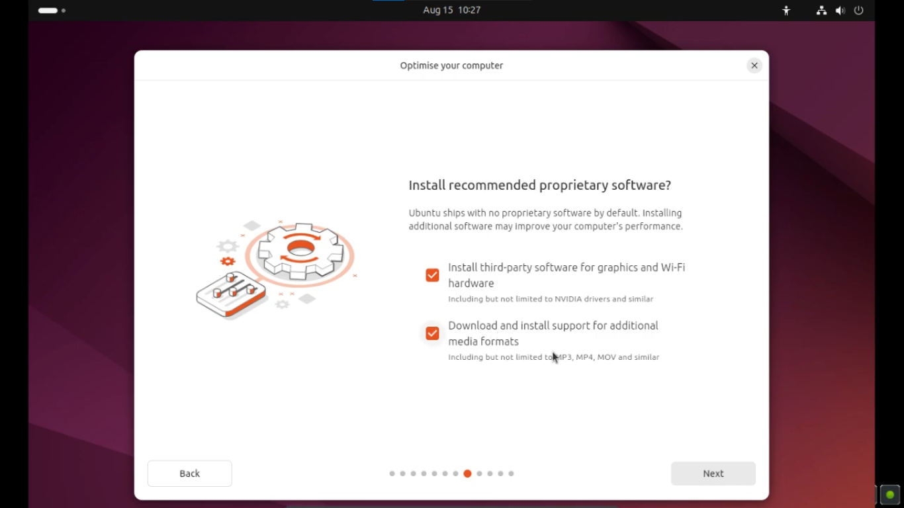
   

#

11. Pilih "Erase disk and install Ubuntu

  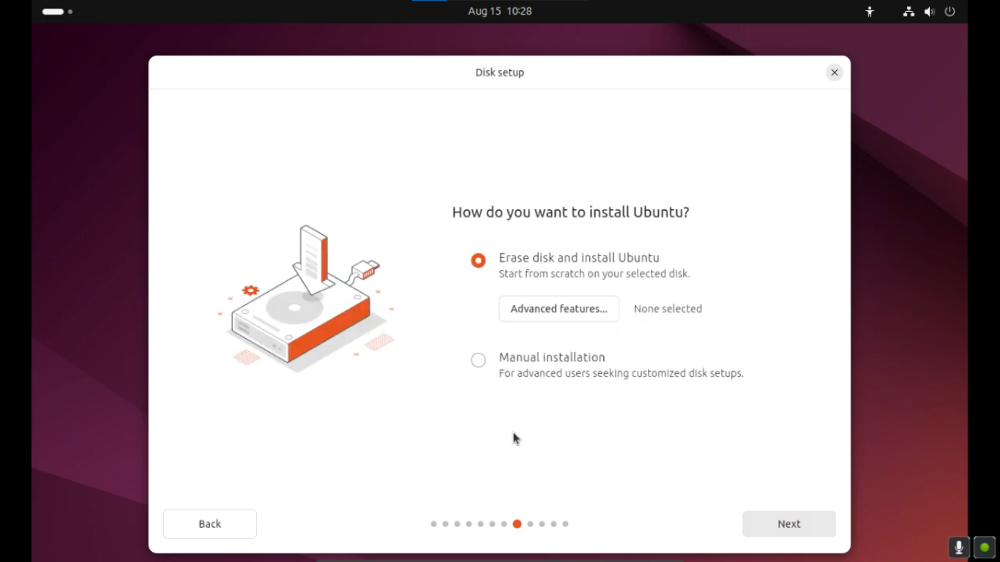
   

#

12. Buat Profil dan password anda

  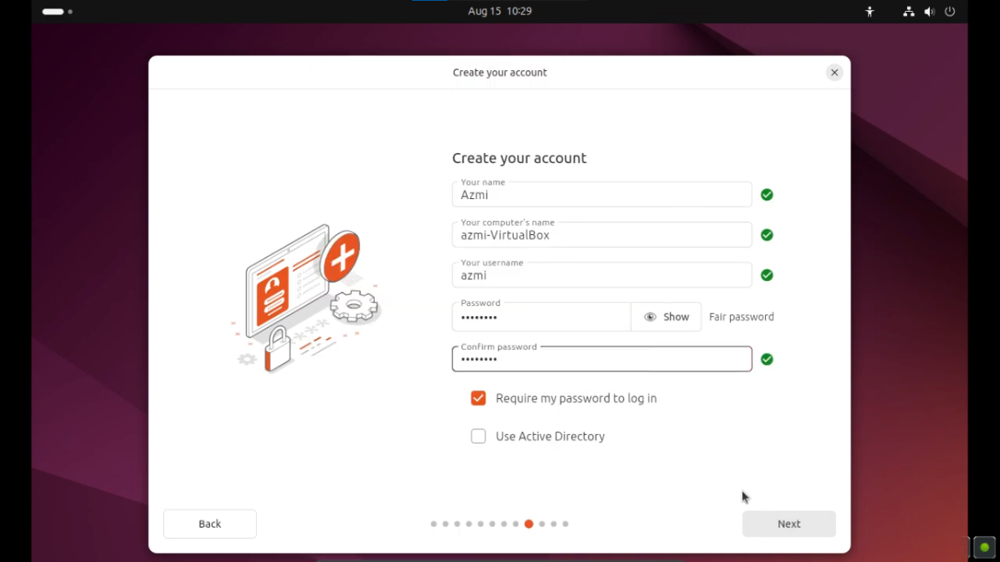
   

#

13. Pilih region anda untuk set time

  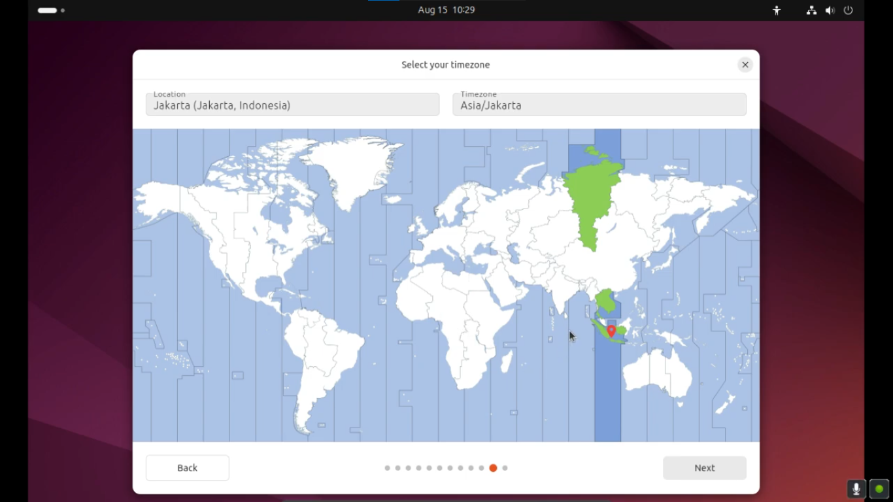
   

#

14. Beginilah overall semua yang sudah di setup

  
   

#

15. Tunggu proses instalasi hingga selesai.ini akan memakan cukup banyak waktu, be patien

  
   

#

16. Saat sudah selesai pilih "Restart now"

  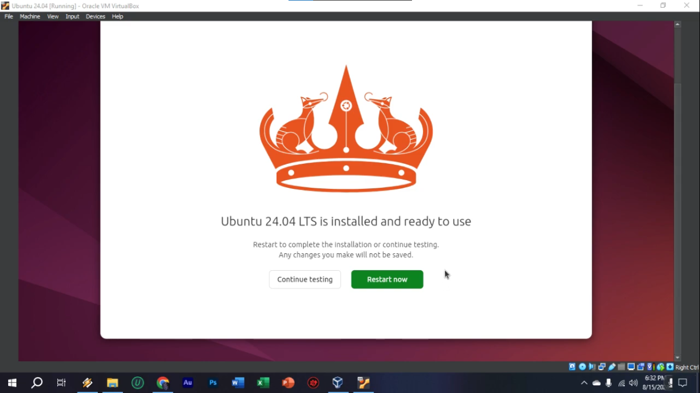
   

#

17. Tekan "Enter" untuk Unmount file .ISO untuk melanjutkan

  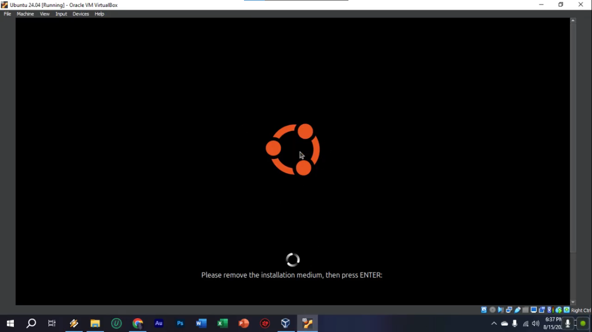
   

#

18. Masukkan Password yang anda buat sebelumnya untuk login

  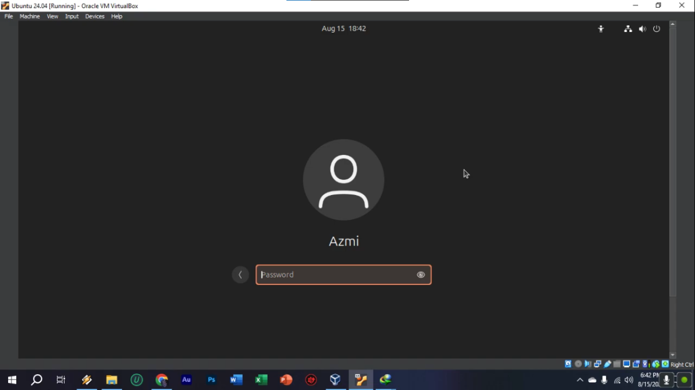
   

#

19. Ubuntu siapa anda gunakan!

  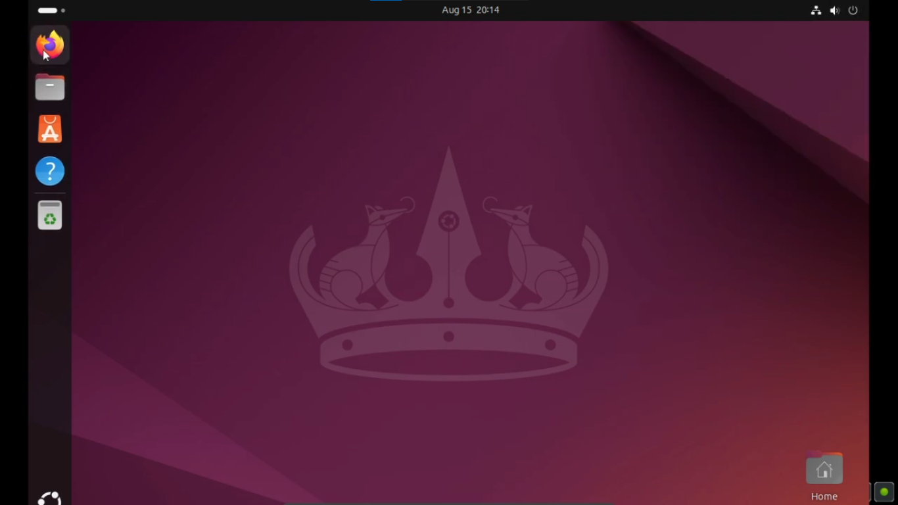
   

  

Tugas 2
-------
2. Analisislah pada gambar kenapa saat instalasi perlu dipilih “/” pada opsi Mount Point ?

   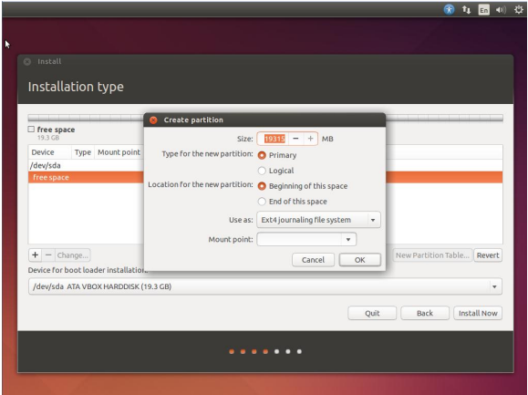

Jawabannya:  

Mount point  adalah direktori root di sistem operasi Linux. Semua file sistem dan direktori lainnya bercabang dari “/”. Ketika memilih “/” sebagai mount point, ini memberitahu sistem bahwa partisi ini adalah tempat semua file sistem operasi, aplikasi, dan konfigurasi dasar akan diinstal.
Mount point sangat penting untuk proses booting. Boot loader akan mengakses file dari partisi yang di-mount ke “/” untuk memulai sistem operasi.

****
3. Berikan penjelasan tentang ext4, ext3, swap, ntfs, fat32,btrfs !

   Jawabannya:   
   
- ext4 adalah sistem berkas yang digunakan secara default oleh banyak distribusi Linux modern. Ini adalah versi yang dikembangkan lagi  dari ext3 dan menyediakan berbagai perbaikan dalam hal kinerja, kapasitas, dan keandalan.Beberapa     kelebihannya seperti mendukung volume hingga 1 EB (exabyte) dan file hingga 16 TB,Stabil, cepat, dan luas digunakan di ekosistem Linux.
   
- ext3 adalah pendahulu dari ext4 dan digunakan secara luas di Linux sebelum ext4 diperkenalkan. Ini menambahkan fitur journaling ke ext2, yang meningkatkan keandalan dengan melacak perubahan yang akan dibuat sebelum      diterapkan.     Kelebihannya iyalah Stabil dan teruji oleh waktu. Kompatibel dengan ext2.

- Swap adalah partisi atau file khusus yang digunakan oleh sistem operasi untuk memperluas memori fisik (RAM) dengan menggunakan ruang disk. Ketika RAM penuh, data yang tidak aktif dipindahkan ke swap, memungkinkan sistem untuk           tetap berjalan dengan lancar. Swap memiliki kekurangan yaitu akses swap jauh lebih lambat dibandingkan RAM fisik, sehingga penggunaan swap secara intensif dapat memperlambat sistem.

- NTFS adalah sistem berkas yang dikembangkan oleh Microsoft dan digunakan sebagai sistem berkas default di sistem operasi Windows modern. NTFS mendukung berbagai fitur canggih seperti keamanan berkas, kompresi, dan enkripsi.             Mendukung volume dan file yang sangat besar (hingga 16 EB teoretis).

- FAT32 adalah sistem berkas lama yang digunakan pada perangkat portabel seperti USB flash drive, dan masih digunakan karena kompatibilitasnya yang luas. FAT32 adalah peningkatan dari FAT16, memungkinkan ukuran partisi yang lebih         besar.Fat32 memiliki Kompatibilitas yang sangat luas dengan berbagai sistem operasi (Windows, Linux, macOS).

- btrfs adalah sistem berkas modern yang dirancang untuk menggantikan ext4 dan menyediakan fitur-fitur canggih seperti snapshot, pooling, dan pemeriksaan integritas data.  
  Ini dikembangkan oleh Oracle dan kini digunakan oleh beberapa distribusi Linux sebagai sistem berkas default.

