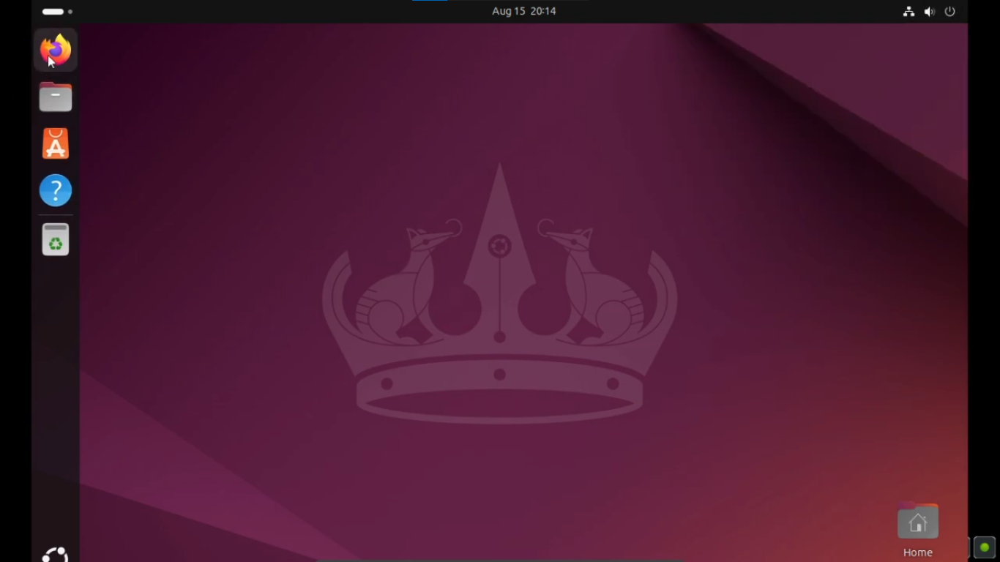
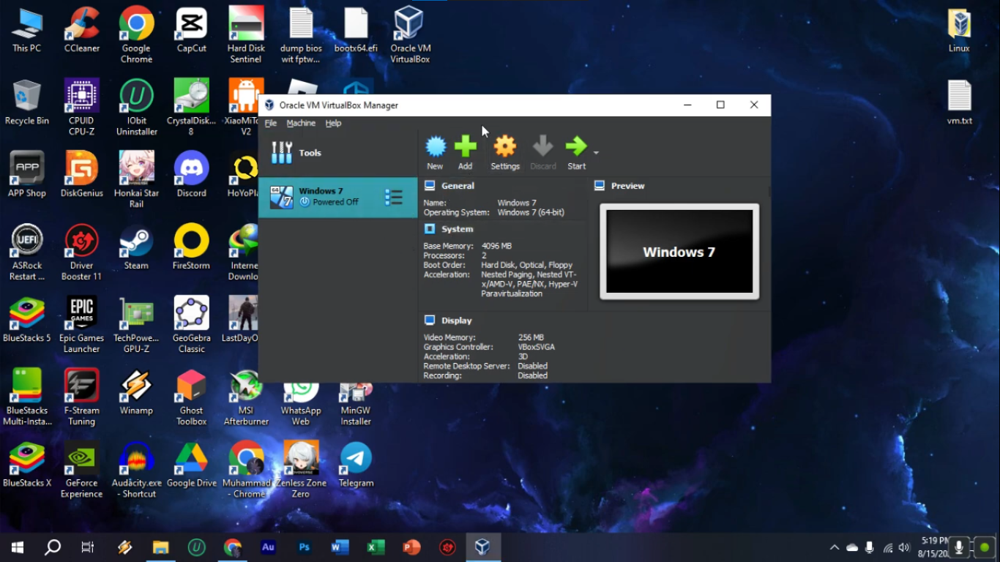
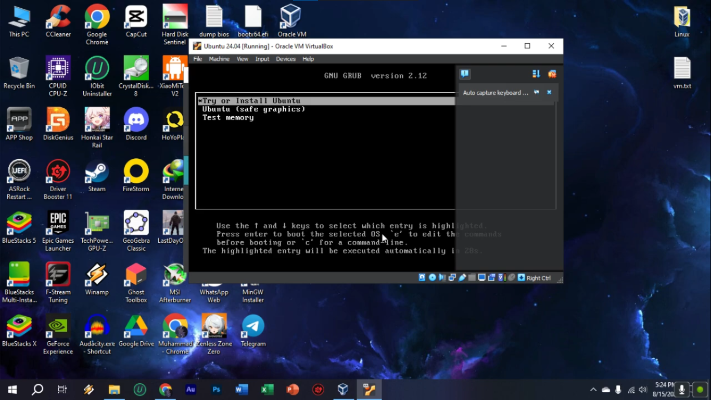
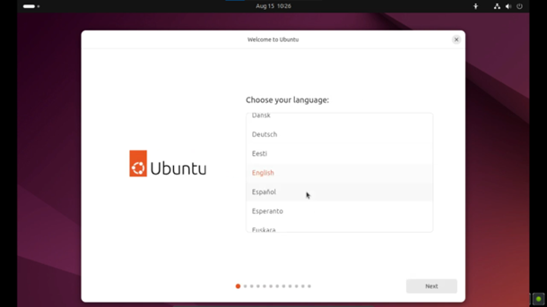
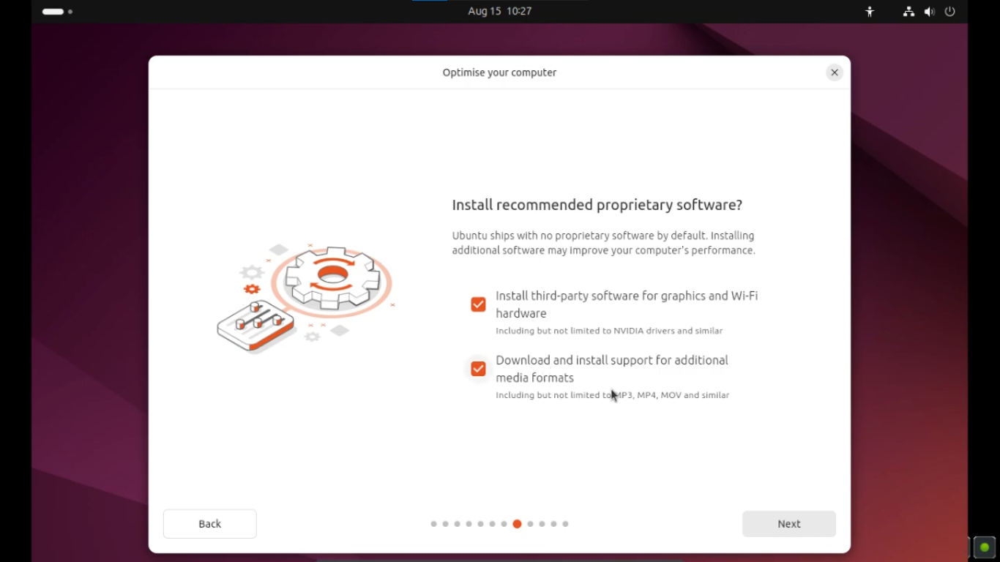
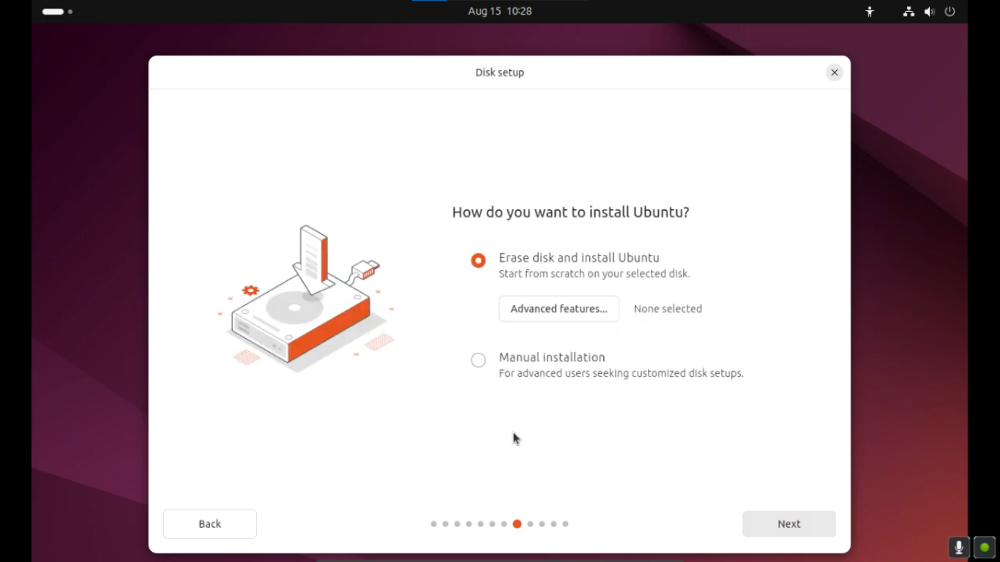
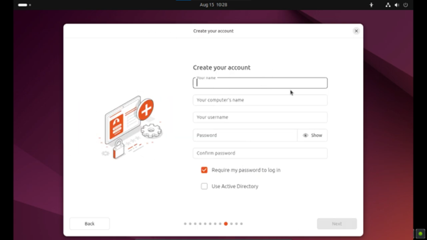
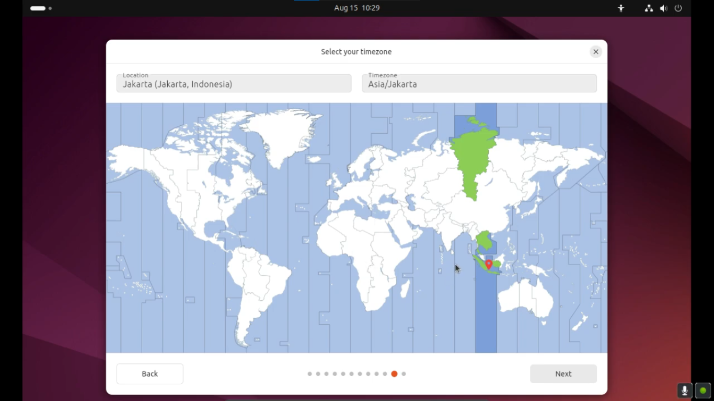
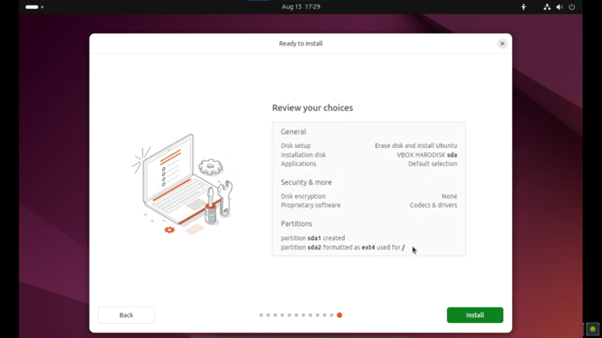
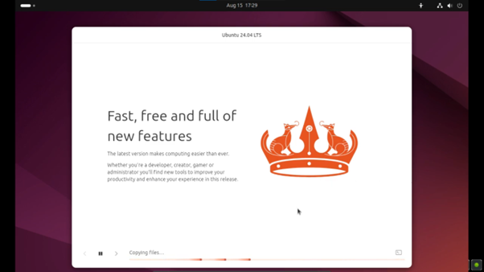

Langkah-langkah Menginstal Ubuntu di Virtualbox

Anda bisa mendownload file PDF untuk diperiksa,download melalui Release dimungkinkan.

Nama: Muhammad Azmi

NIM: 09011282328075

Kelas: SK3C

MK: Praktikum Sistem Operasi

1. Pada virtualbox pilih Add untuk menambahkan operating system baru.
   
   

2. Beri nama virtual machine dan pilih file .iso dari operating system yang ingin di pasang.
                     Disini saya menggunakan Linux Ubuntu 24.04 LTS.
   
   

3. Sesuaikan Memory dan prosessor yang akan dialokasikan untuk virtual machine yang akan digunakan.

    
    
   
   
   
   
   
   
   
   
   
   
   
